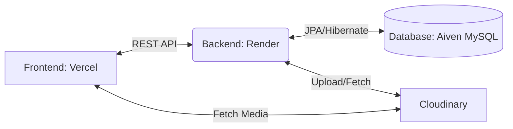

<div align="center">
  
  
  # MediFind
  
  *A comprehensive healthcare platform connecting Patients, Doctors, and Hospitals.*

  
  
  
  
  
  
</div>

## 1. Project Overview

**MediFind** is a centralized healthcare platform that seamlessly connects Patients, Doctors, and Hospitals. It aims to make healthcare access simple, intuitive, and efficient.

### Features
- User Authentication (JWT)
- Patient, Doctor, and Hospital registration
- Appointment booking
- Hospital discovery
- Doctor discovery
- Emergency contacts
- Profile management
- Cloudinary image uploads

---

## 2. Tech Stack

### Frontend
- React
- Vite
- React Router
- Axios
- Context API

### Backend
- Spring Boot
- Spring Security
- JWT Authentication
- Spring Data JPA
- Hibernate

### Database
- MySQL (Aiven)

### Cloud Services
- Render (Backend)
- Vercel (Frontend)
- Cloudinary (Media Storage)

---

## 3. Project Structure

```text
medifind/
├── frontend/                     # React application (Vite)
│   ├── public/                   # Static assets
│   ├── src/                      # React source code
│   ├── package.json              # Frontend dependencies
│   └── vite.config.js            # Vite configuration
├── medifind-backend/             # Spring Boot monolithic application
│   ├── src/main/java/            # Java source code
│   ├── src/main/resources/       # Backend configuration
│   ├── pom.xml                   # Maven dependencies
│   └── Dockerfile                # Docker configuration
├── database/                     # Database seed scripts
└── README.md                     # Project documentation
```

---

## 4. Architecture Overview



---

## 5. Environment Variables

Create `.env` files based on the examples provided. **Do not expose actual secrets in your repository.**

### Frontend (`frontend/.env`)
```env
VITE_API_BASE_URL=http://localhost:8080/api
```

### Backend (`medifind-backend/src/main/resources/application.properties` or OS Environment Variables)
```env
# Database Configuration
DB_HOST=my-aiven-host.aivencloud.com
DB_PORT=25060
DB_NAME=medifind_db
DB_USERNAME=avien_user
DB_PASSWORD=avien_password

# JWT Security
JWT_SECRET=your_super_secret_jwt_key_placeholder
CORS_ALLOWED_ORIGINS=http://localhost:5173,https://medifind.vercel.app

# Cloudinary Integration
CLOUDINARY_CLOUD_NAME=your_cloud_name
CLOUDINARY_API_KEY=your_api_key
CLOUDINARY_API_SECRET=your_api_secret

# Default Admin Credentials
ADMIN_EMAIL=admin@medifind.com
ADMIN_PASSWORD=secureAdminPassword123
ADMIN_NAME=SuperAdmin
```

---

## 6. Local Development Setup

### Prerequisites
- Node.js (v18+)
- Java 21+
- Maven
- MySQL Server

### Frontend
```bash
cd frontend
npm install
npm run dev
```

### Backend
```bash
cd medifind-backend
mvn clean install
mvn spring-boot:run
```

---

## 7. Docker Deployment

To build and run the backend using Docker:

1. **Build the image**
```bash
cd medifind-backend
docker build -t medifind-backend .
```

2. **Run the container**
```bash
docker run -p 8080:8080 --env-file .env medifind-backend
```

---

## 8. Production Deployment

### Backend Deployment (Render)
1. Connect your GitHub repository to Render.
2. Select **Docker** deployment (or web service using Docker).
3. Configure the environment variables (DB, JWT, Cloudinary) in the Render dashboard.
4. Deploy the service.

### Frontend Deployment (Vercel)
1. Connect your GitHub repository to Vercel.
2. Configure the `VITE_API_BASE_URL` environment variable to point to your Render backend URL.
3. Deploy the project.

### Database
- Create an Aiven MySQL instance.
- Provide the required connection details (`DB_HOST`, `DB_PORT`, `DB_NAME`, `DB_USERNAME`, `DB_PASSWORD`) to your backend deployment.

---

## 9. API Documentation

Swagger API documentation is available when the backend is running.

```text
https://<backend-url>/swagger-ui/index.html
```
*(For local development: `http://localhost:8080/swagger-ui/index.html`)*

---

## 10. Security

- **JWT Authentication:** Secure, stateless token-based authentication.
- **Password Encryption:** Passwords are hashed and salted using BCrypt.
- **Spring Security:** Fine-grained role-based access control.
- **CORS Configuration:** Restricted origins to prevent Cross-Origin Request Forgery.

---

## 11. Future Enhancements

- **Medical store availability and location tracking:** Helping users find nearby pharmacies.
- **Real-time notifications:** Alerts for appointments and emergency updates.
- **Video consultations:** Seamless virtual meetings with doctors.
- **AI-based hospital recommendations:** Smart suggestions based on symptoms and location.
- **Multi-language support:** Accessibility across different regions.
- **Analytics dashboard:** Insights for hospital administrators and doctors.

---

## 12. Contribution Guidelines

Contributions are welcome!
1. Fork the project.
2. Create your feature branch (`git checkout -b feature/AmazingFeature`).
3. Commit your changes (`git commit -m 'Add some AmazingFeature'`).
4. Push to the branch (`git push origin feature/AmazingFeature`).
5. Open a Pull Request.
